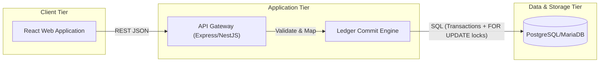

# Architecture

## 1. System Overview

The rebuild employs a multi-tiered architecture using Node.js for the API backend, React for the frontend, and a relational database for ACID-compliant ledger storage.

## 2. Component Responsibilities

1. **Client Tier**: A React SPA that renders views (Invoices, Journals, Accounts) and performs state management. It communicates with the backend exclusively via REST APIs.
2. **API Tier**: Exposes protected REST controllers. Validates inbound payloads, authenticates users, and enforces role-based authorization guards before passing data to domain services.
3. **Ledger Engine (Core)**: 
   - A centralized service responsible for interpreting business operations (like "Issue Invoice") into balanced debits and credits.
   - It strictly runs inside a database transaction (`UnitOfWork`).
   - It acquires pessimistic row locks (`FOR UPDATE`) on accounts before calculating new balances.
   - It asserts that the sum of debits exactly matches the sum of credits before executing the `COMMIT`.
4. **Database (MainDB)**: A relational database ensuring ACID properties. Handles referential integrity, indexes on frequently queried fields, and enforces unique constraints at the schema level. Document numbers (e.g. `invoice_no`) achieve uniqueness by relying on "insert + catch DB unique-violation + retry" logic instead of vulnerable in-memory series counters.

## 3. Data Integrity & Transactions

- **UnitOfWork Pattern**: All business operations (e.g., creating an invoice and its ledger lines) are wrapped in a single database transaction. If any sub-step fails, everything is rolled back.
- **Race Condition Prevention**: Unique constraint validations (e.g., ensuring an invoice number is unique) are enforced via database-level `UNIQUE` indices.
- **Precision**: Money is stored as integers (cents) in the database and formatted on the frontend, ensuring no floating-point arithmetic errors occur during backend summarization.

## 4. Where State Lives

All application state lives in a single place: the relational database (MainDB).
- **Persistent state**: Chart of accounts, invoices, bills, payments, journal entries, and account balances are all stored in MainDB tables, as detailed in DATA_MODEL.md.
- **No cache layer**: There is no Redis, in-memory cache, or external state store. The Trial Balance, the GST Filing Pack, and all other reports are computed directly from `accounts_transactions` (and, for GST, `items_entries`) rows at query time, not from a cached running total — this avoids a stale "cached balance vs. actual transactions" drift class of bug entirely, rather than patching it after the fact.
- **No browser-side state for financial data**: The React client holds only UI state (form inputs, loading flags) in memory. It never caches account balances or ledger totals client-side; every balance shown is fetched fresh from the API.
- **Session state**: The JWT issued at login is the only piece of state held outside the database, stored client-side for the duration of the session.

## 5. How to Run

1. **Prerequisites**: Ensure Node.js (v18+) and PostgreSQL/MariaDB are running.
2. **Install**: Run `npm install` to fetch dependencies for both backend and frontend.
3. **Database**: Run `npm run migrate` to apply schema migrations and `npm run seed` to insert default roles and the chart of accounts.
4. **Start**: Run `npm run dev` to start the backend API on port 3000 and the React SPA on port 4000.

## 6. Environment Variables
A `.env.example` will be provided at the root with the following minimal configurations:
- `PORT` (e.g., 3000)
- `DB_HOST`, `DB_PORT`, `DB_USER`, `DB_PASS`, `DB_NAME` (Database connection parameters)
- `JWT_SECRET` (For cryptographic signing of authentication tokens)
- `NODE_ENV` (e.g., `development`, `production`)
- `SEED_ADMIN_EMAIL`, `SEED_ADMIN_PASSWORD` (Bootstraps the first Admin user)
- `TEST_SEED`, `TEST_OPS_COUNT` (Controls the KT3 concurrency test harness)

## 7. Test & Seed Tooling

- **Seed script**: Populates the 6 default accounts (see PRD.md §2b) and one Admin user on first run.
- **Test harness**: `POST /api/test/seed-random`, gated behind `NODE_ENV=test`, implements Killer Test 3's concurrency check by firing `TEST_OPS_COUNT` (default 20) parallel operations using `TEST_SEED` for reproducibility.

## 8. GST Filing Pack Report

The GST Filing Pack (`GET /api/v1/reports/gst`, see API.md and PRD.md §2d) is a **read-only
query**, not a new write path — it introduces no new ledger-posting logic beyond the GST tax
split already described in DATA_MODEL.md §3.

- **What it reads**: `items_entries` rows (for the by-rate and by-HSN blocks) and
  `accounts_transactions` rows on the three GST payable accounts (for the tie-out block). Like
  every other report in this system (§4 above), nothing is cached — each request re-derives both
  blocks fresh.
- **Which invoices count**: only invoices whose status is `Delivered`, `Partially Paid`, or
  `Paid`, and whose invoice date falls inside the requested month in the shop's own timezone.
  `Draft` invoices (never posted) and `Voided` invoices are excluded — a void's reversal already
  nets its ledger impact to zero, so excluding the invoice from the report and letting the
  reversal cancel it in the ledger both agree with each other by construction.
- **The tie-out**: for the same calendar month, sum `credit - debit` on each of the CGST Payable,
  SGST Payable, and IGST Payable accounts from posted `accounts_transactions` rows, and compare
  that to the report's own summed totals for that tax type. Equal → ✓; any difference → ✗ with
  the rupee gap shown, which would only happen if a bug let an invoice post to the ledger without
  its line-level GST fields being stored consistently — something the acceptance criteria in
  PRD.md §2d are designed to catch.
