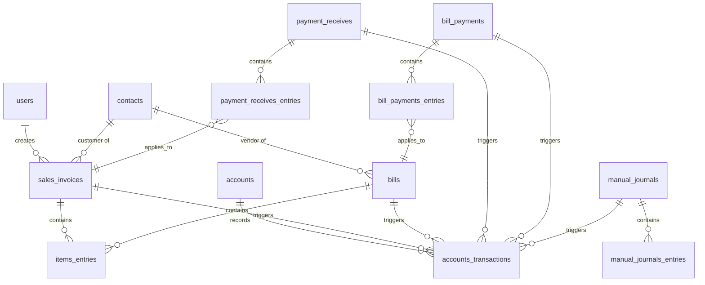

# Data Model

## 1. Schema Definitions



## 2. Core Tables

### `users`
System users who manage the ledger.
Note: The first `users` row (Admin) is inserted by the seed script, not via the API — see PRD.md §2c.
- `id` (Primary Key)
- `email` (String, UNIQUE Index)
- `password_hash` (String)
- `role` (Enum) - 'Admin', 'Accountant', 'Staff'

### `accounts`
Stores the hierarchical chart of accounts.
- `id` (Primary Key)
- `code` (String, **UNIQUE** Index) - Account identifier. Enforced as a true UNIQUE constraint, not a plain index — the same schema-level guarantee described for document numbers in GAPS.md §1(a), applied here to account codes too.
- `name` (String, Indexed)
- `account_type` (Enum) - e.g., 'Asset', 'Liability', 'Equity', 'Revenue', 'Expense'.
- `parent_account_id` (Foreign Key -> accounts.id) - Enables hierarchical rollups.
- `balance` (Integer) - Stored in cents. Updated via `FOR UPDATE` locks during transactions.

### `contacts`
Stores customers and vendors.
- `id` (Primary Key)
- `contact_type` (Enum) - 'Customer' or 'Vendor'.
- `name` (String)

### `sales_invoices`
Stores customer invoices.
- `id` (Primary Key)
- `invoice_no` (String, UNIQUE Index)
- `customer_id` (Foreign Key -> contacts.id)
- `created_by_id` (Foreign Key -> users.id) - The user who created the invoice.
- `total_amount` (Integer) - Stored in cents.
- `status` (Enum) - 'Draft', 'Delivered', 'Partially Paid', 'Paid', 'Voided'.
  - Transitions: Draft → Delivered (on deliver) → Partially Paid (when `sum(amount_applied) < total_amount`) → Paid (when `sum(amount_applied) == total_amount`) → Voided (from any non-Voided state, if no payments exist; see GAPS.md / API.md error `ERR_HAS_PAYMENTS`).

### `bills`
Stores vendor purchase bills.
- `id` (Primary Key)
- `bill_number` (String, UNIQUE Index)
- `vendor_id` (Foreign Key -> contacts.id)
- `total_amount` (Integer) - Stored in cents.
- `status` (Enum) - 'Draft', 'Open', 'Partially Paid', 'Paid', 'Voided'.
  - Transitions: Draft → Open (on open) → Partially Paid (when `sum(amount_applied) < total_amount`) → Paid (when `sum(amount_applied) == total_amount`) → Voided (from any non-Voided state, if no payments exist; see GAPS.md / API.md error `ERR_HAS_PAYMENTS`).

### `items_entries`
Line items for invoices and bills.
- `id` (Primary Key)
- `reference_type` (String) - Polymorphic ('SaleInvoice', 'Bill').
- `reference_id` (Integer, Indexed)
- `amount` (Integer) - Stored in cents.
- `tax_rate` (Integer) - Tax percentage in basis points (e.g. 1800 = 18.00%). Nullable; 0/null means no tax applied.
- `tax_amount` (Integer) - Computed tax in cents for this line, stored in cents.

### `payment_receives` & `payment_receives_entries`
Records incoming payments applied to invoices.
- **`payment_receives`**: `id`, `payment_receive_no` (UNIQUE Index), `customer_id`, `amount` (Integer, cents).
- **`payment_receives_entries`**: `id`, `payment_receive_id`, `invoice_id`, `amount_applied` (Integer, cents).

### `bill_payments` & `bill_payments_entries`
Records outgoing payments applied to bills.
- **`bill_payments`**: `id`, `payment_number` (UNIQUE Index), `vendor_id`, `amount` (Integer, cents).
- **`bill_payments_entries`**: `id`, `bill_payment_id`, `bill_id`, `amount_applied` (Integer, cents).

### `manual_journals` & `manual_journals_entries`
Direct journal entries made by accountants.
- **`manual_journals`**: `id`, `journal_number` (UNIQUE Index), `date`, `notes`.
- **`manual_journals_entries`**: `id`, `manual_journal_id`, `account_id`, `debit` (cents), `credit` (cents).

### `accounts_transactions`
The general ledger entries. Double-entry is strictly enforced.
- `id` (Primary Key)
- `account_id` (Foreign Key -> accounts.id)
- `reference_type` (String) - Polymorphic origin ('SaleInvoice', 'Bill', 'PaymentReceive', 'BillPayment', 'ManualJournal').
- `reference_id` (Integer, Indexed)
- `debit` (Integer) - Stored in cents.
- `credit` (Integer) - Stored in cents.
- **Constraint**: `CHECK ((debit > 0 AND credit = 0) OR (credit > 0 AND debit = 0))` - strictly enforces that a line is either a debit or a credit, never both.

## 3. GST Filing Pack Fields

These fields exist solely to support the GST Filing Pack report (see PRD.md §2d, API.md). None
of them change how an invoice posts to the ledger today — they are additive columns a line can
leave empty, and the existing Core Flow (§2 above) works unchanged if they are never filled in.

This ledger has no product/inventory catalog (inventory is explicitly Won't Have per PRD.md), so
there is no separate `items` master table. The HSN code and GST split live directly on the
existing `items_entries` line-item row, not on a separate catalog entity.

| Table | New field | Type | Notes |
|---|---|---|---|
| `shop_settings` (new, single row) | `gstin` | String, nullable | The business's own GSTIN. |
| `shop_settings` | `state_code` | String, nullable | The business's own state code — the baseline for deciding intra- vs. inter-state. |
| `contacts` | `gstin` | String, nullable | Customer's GSTIN, optional. |
| `contacts` | `state_code` | String, nullable | Customer's state code. If it matches `shop_settings.state_code`, the sale is intra-state (CGST+SGST); otherwise inter-state (IGST). |
| `items_entries` | `hsn_code` | String, nullable | HSN/product code for this line. A line with no HSN code is reported under `(missing HSN)`, never dropped. |
| `items_entries` | `cgst_paise` | Integer, default 0 | Stored at line-creation time. |
| `items_entries` | `sgst_paise` | Integer, default 0 | Stored at line-creation time. |
| `items_entries` | `igst_paise` | Integer, default 0 | Stored at line-creation time. |
| `accounts` (seed) | — | — | Three additional liability accounts: **CGST Payable**, **SGST Payable**, **IGST Payable** — alongside (not replacing) the existing generic `Tax Payable` (2100) used by non-GST tax lines. |

**Units**: all of the above money fields are integer paise (the rupee equivalent of the cents
convention already used everywhere else in this schema — see ARCHITECTURE.md §3, "Precision").
`items_entries.tax_rate`, already defined in basis points (§2, Core Tables), is reused as the GST
rate for these lines; no new rate field is introduced. For a GST line, `cgst_paise + sgst_paise +
igst_paise` always equals the line's existing `tax_amount` (§2) — the three new columns are a
breakdown of that same already-existing total, not a second, competing source of truth for it.

**GST computation rule** (applied once, at the moment the line is created — never recomputed
when the report runs later):
```
line_tax_paise  = round_half_up(taxable_paise * rate_bp / 10000)
if customer.state_code == shop_settings.state_code (intra-state):
    cgst_paise = floor(line_tax_paise / 2)
    sgst_paise = line_tax_paise - cgst_paise
    igst_paise = 0
else (inter-state):
    cgst_paise = 0
    sgst_paise = 0
    igst_paise = line_tax_paise
```

**Why this matters for correctness**: the GST Filing Pack report (API.md) only **sums** these
already-stored `cgst_paise` / `sgst_paise` / `igst_paise` columns grouped by rate, by intra- vs.
inter-state, and by HSN code. It never re-derives tax from `taxable_paise * rate_bp` at report
time. This is deliberate: if two lines rounded a half-paise differently at creation time, summing
the stored amounts can never drift from what was actually posted to the ledger, because the
report and the ledger both read from the same already-rounded numbers. No report total is ever
cached — every run of the report re-sums `items_entries` and re-reads the three payable accounts'
`accounts_transactions` rows fresh.

## 4. Constraints for Killer Tests
- **Transaction Balancing**: The application code asserts `sum(debit) == sum(credit)` in memory, and rows are inserted together inside a `UnitOfWork`.
- **Voiding**: No `ON DELETE CASCADE` is set from transactions to `accounts_transactions`. Voiding creates exact opposite `accounts_transactions` payloads to nullify balances.
- **Trial Balance & Concurrency**: All tables with denormalized running balances (e.g., `accounts.balance`) are updated strictly after a `SELECT ... FOR UPDATE` lock within the transaction.
