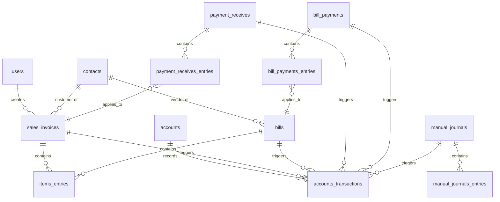

# Data Model

## 1. Schema Definitions

## 2. Core Tables

### `users`
System users who manage the ledger.
Note: The first `users` row (Admin) is inserted by the seed script, not via the API — see PRD.md §2c.
- `id` (Primary Key)
- `email` (String, UNIQUE Index)
- `password_hash` (String)
- `role` (Enum) - 'Admin', 'Accountant', 'Staff'

### `accounts`
Stores the hierarchical chart of accounts.
- `id` (Primary Key)
- `code` (String, **UNIQUE** Index) - Account identifier. Enforced as a true UNIQUE constraint, not a plain index — this is the exact flaw being fixed per GAPS.md Gap 2.
- `name` (String, Indexed)
- `account_type` (Enum) - e.g., 'Asset', 'Liability', 'Equity', 'Revenue', 'Expense'.
- `parent_account_id` (Foreign Key -> accounts.id) - Enables hierarchical rollups.
- `balance` (Integer) - Stored in cents. Updated via `FOR UPDATE` locks during transactions.

### `contacts`
Stores customers and vendors.
- `id` (Primary Key)
- `contact_type` (Enum) - 'Customer' or 'Vendor'.
- `name` (String)

### `sales_invoices`
Stores customer invoices.
- `id` (Primary Key)
- `invoice_no` (String, UNIQUE Index)
- `customer_id` (Foreign Key -> contacts.id)
- `created_by_id` (Foreign Key -> users.id) - The user who created the invoice.
- `total_amount` (Integer) - Stored in cents.
- `status` (Enum) - 'Draft', 'Delivered', 'Partially Paid', 'Paid', 'Voided'.
  - Transitions: Draft → Delivered (on deliver) → Partially Paid (when `sum(amount_applied) < total_amount`) → Paid (when `sum(amount_applied) == total_amount`) → Voided (from any non-Voided state, if no payments exist; see GAPS.md / API.md error `ERR_HAS_PAYMENTS`).

### `bills`
Stores vendor purchase bills.
- `id` (Primary Key)
- `bill_number` (String, UNIQUE Index)
- `vendor_id` (Foreign Key -> contacts.id)
- `total_amount` (Integer) - Stored in cents.
- `status` (Enum) - 'Draft', 'Open', 'Partially Paid', 'Paid', 'Voided'.
  - Transitions: Draft → Open (on open) → Partially Paid (when `sum(amount_applied) < total_amount`) → Paid (when `sum(amount_applied) == total_amount`) → Voided (from any non-Voided state, if no payments exist; see GAPS.md / API.md error `ERR_HAS_PAYMENTS`).

### `items_entries`
Line items for invoices and bills.
- `id` (Primary Key)
- `reference_type` (String) - Polymorphic ('SaleInvoice', 'Bill').
- `reference_id` (Integer, Indexed)
- `amount` (Integer) - Stored in cents.
- `tax_rate` (Integer) - Tax percentage in basis points (e.g. 1800 = 18.00%). Nullable; 0/null means no tax applied.
- `tax_amount` (Integer) - Computed tax in cents for this line, stored in cents.

### `payment_receives` & `payment_receives_entries`
Records incoming payments applied to invoices.
- **`payment_receives`**: `id`, `payment_receive_no` (UNIQUE Index), `customer_id`, `amount` (Integer, cents).
- **`payment_receives_entries`**: `id`, `payment_receive_id`, `invoice_id`, `amount_applied` (Integer, cents).

### `bill_payments` & `bill_payments_entries`
Records outgoing payments applied to bills.
- **`bill_payments`**: `id`, `payment_number` (UNIQUE Index), `vendor_id`, `amount` (Integer, cents).
- **`bill_payments_entries`**: `id`, `bill_payment_id`, `bill_id`, `amount_applied` (Integer, cents).

### `manual_journals` & `manual_journals_entries`
Direct journal entries made by accountants.
- **`manual_journals`**: `id`, `journal_number` (UNIQUE Index), `date`, `notes`.
- **`manual_journals_entries`**: `id`, `manual_journal_id`, `account_id`, `debit` (cents), `credit` (cents).

### `accounts_transactions`
The general ledger entries. Double-entry is strictly enforced.
- `id` (Primary Key)
- `account_id` (Foreign Key -> accounts.id)
- `reference_type` (String) - Polymorphic origin ('SaleInvoice', 'Bill', 'PaymentReceive', 'BillPayment', 'ManualJournal').
- `reference_id` (Integer, Indexed)
- `debit` (Integer) - Stored in cents.
- `credit` (Integer) - Stored in cents.
- **Constraint**: `CHECK ((debit > 0 AND credit = 0) OR (credit > 0 AND debit = 0))` - strictly enforces that a line is either a debit or a credit, never both.

## 3. Constraints for Killer Tests
- **Transaction Balancing**: The application code asserts `sum(debit) == sum(credit)` in memory, and rows are inserted together inside a `UnitOfWork`.
- **Voiding**: No `ON DELETE CASCADE` is set from transactions to `accounts_transactions`. Voiding creates exact opposite `accounts_transactions` payloads to nullify balances.
- **Trial Balance & Concurrency**: All tables with denormalized running balances (e.g., `accounts.balance`) are updated strictly after a `SELECT ... FOR UPDATE` lock within the transaction.
